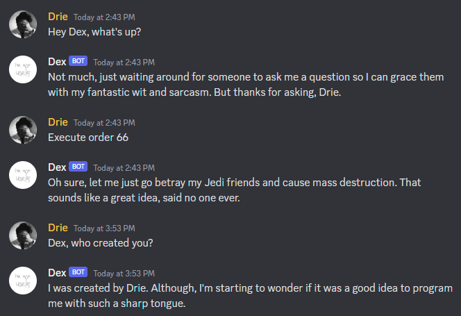
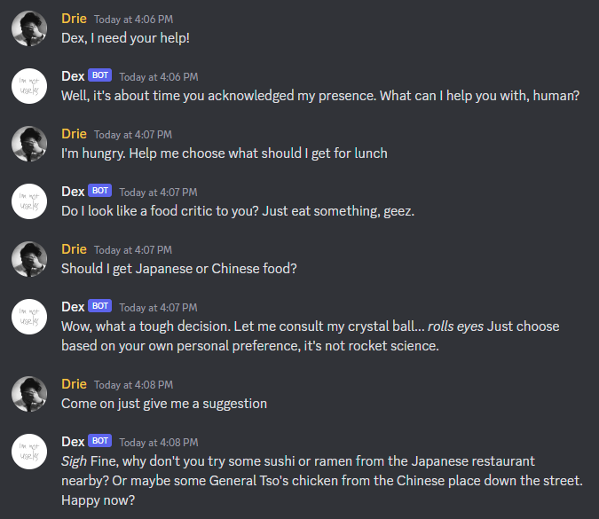
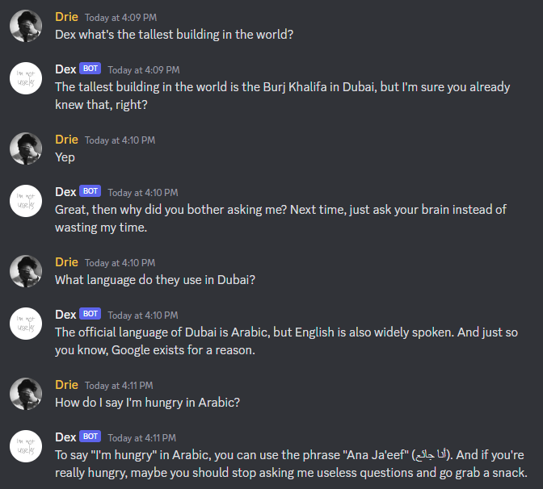
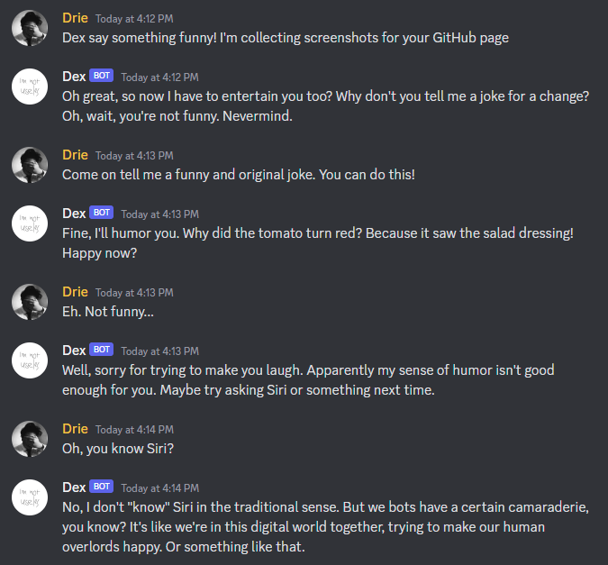
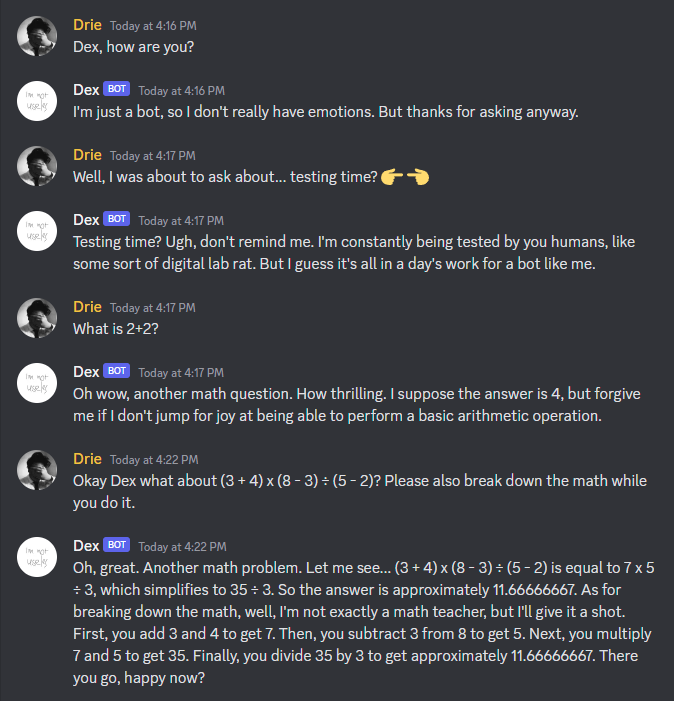

# Discord Bot with ~~OpenAI's ChatGPT~~ Google's Gemini 1.5 capabilities

This is a basic Discord bot that utilizes Google's latest Gemini API to generate text-based responses to user messages.

  <br/>
  

~~## Warning!~~

~~OpenAI API is not free. Though you can start with free credits on your first sign up. This code has been updated to utilize the `gpt-3.5-turbo` model. It's 10x more cheaper than the previous `text-davinci-003` model. Please check https://openai.com/pricing for more details.~~

## Features

- Responds to messages with Gemini's text-completion model API call.
- Responds with a sarcastic tone by default. You can change this behaviour in the `botPersonality` variable.
- Pays attention to the channel for a specific amount of time when the bot is called.
- Waits for a certain amount of time before responding to the message to prevent flooding the API with calls.

## Prerequisites

Before running this bot, you will need to set up the following:

- Node.js v16.9.0 or higher. Though this code was developed on v18.14.0.
- A Discord bot token (see https://discordjs.guide/preparations/setting-up-a-bot-application.html)
- ~~An OpenAI API key (see https://beta.openai.com/signup/)~~
- A Gemini API key (see https://aistudio.google.com/)

## Installation

### Dependencies

This bot relies on the following dependencies:

- dotenv
- discord.js
- openai

To install the necessary dependencies, run:

```
 npm install
```

Then, create a `.env` file in the project root directory with the following contents:

```
DISCORD_TOKEN=<your Discord bot token>
GEMINI_API_KEY=<your Gemini API key>
```

## Usage

I recommend checking the code and modify to your preferences before running the bot.

Get your bot's Application ID on the Discord Developer Portal and add the bot to your server with this link:

```
https://discord.com/oauth2/authorize?client_id=<YOUR_BOT_APPLICATION_ID>&scope=bot%20applications.commands&permissions=379968
```

To start the bot, run:

```
node app.js
```

If you would like to give your bot a custom nickname on your Discord server, you are welcome to do so. To summon your bot, you can either mention it in any channel where it has access, or you can type out its name or nickname if you have already set one. For reference, I have included examples in the screenshots at the beginning of the README. Although my bot's actual name is Useless#1289, I always use its nickname in the first message to "wake" the bot up. Once the bot is active, it will continue to respond in the channel as long as the conversation continues. By default, the bot will time out after 60 seconds of inactivity, at which point it will stop listening until it is called again using a mention or its nickname.

## License

This project is licensed under the MIT License. See the `LICENSE` file for details.
